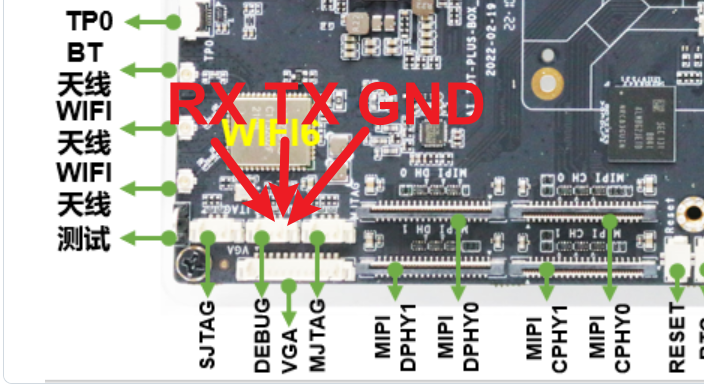
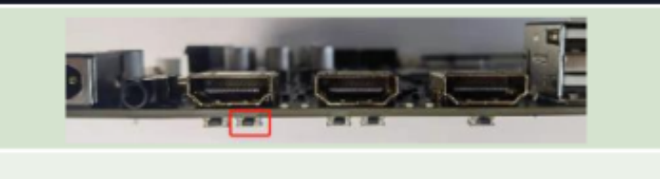

# rk3588-owl-ai-box-plus 猫头鹰微视科技 RK3588开发板

## 免责声明

1. 按“原样”提供与风险自负

   本镜像及相关资源均按“原样（As-Is）”及“现有（As-Available）”基础提供，不提供任何形式的明示或暗示保证（包括但不限于适销性、特定用途适用性及非侵权性的暗示保证）。用户应自行评估并承担使用本镜像所产生的全部风险，包括但不限于数据丢失、系统故障或业务中断等后果。

2. 非官方关联声明

   本项目/镜像为第三方独立构建与维护，与任何上游软件的官方开发商、商标持有人或版权方均不存在任何形式的隶属、授权、赞助或合作关系。所有商标及产品名称仅用于描述及识别目的，其权利归各自所有者所有。

3. 安全合规与用户责任 本镜像仅作基础构建打包之用，不承诺默认配置符合生产环境安全标准。用户在部署前务必履行以下安全义务：

* 及时检查并应用最新安全补丁；
* 修改所有默认凭证及弱口令；
* 根据实际业务需求进行网络安全加固与权限最小化配置。
* 因未及时加固或不当配置导致的安全事件，由用户自行承担全部责任。

4. 知识产权与来源说明

   本镜像内包含的所有源代码、组件及依赖均源自第三方开源项目，仅执行自动化构建与打包流程，不对原始代码的功能完整性、安全性或合法性作额外背书。请用户在使用前自行查阅并遵守各上游组件对应的开源许可协议（License），确保合规使用。

## 目录

* [开发板基本信息](docs/开发板基本信息.md)
* [官方SDK构建](docs/官方SDK构建.md)
* [内核构建](docs/内核构建/内核构建.md)
* [官方文档列表](官方文档列表.md)
* [驱动](docs/驱动.md)
    * [PCIE驱动](docs/驱动/PCIE驱动/PCIE驱动.md)
    * [网卡驱动](docs/驱动/网卡驱动/网卡驱动.md)
    * [WIFI驱动](docs/驱动/WLAN驱动/BCM43752无线网卡驱动.md)
    * [蓝牙驱动](docs/驱动/蓝牙驱动/蓝牙驱动.md)
    * [LED驱动](docs/驱动/LED驱动/LED驱动.md)
    * [USB驱动](docs/驱动/USB驱动/USB驱动.md)
    * [HDMI驱动](docs/驱动/HDMI驱动/HDMI驱动.md)
    * [SATA驱动](docs/驱动/SATA驱动/SATA驱动.md)
    * [音频驱动](docs/驱动/音频驱动/音频驱动.md)
    * [按键驱动](docs/驱动/按键驱动/按键驱动.md)
    * [RTC时钟驱动](docs/驱动/RTC时钟驱动/RTC时钟驱动.md)
    * [风扇驱动](docs/驱动/风扇驱动/风扇驱动.md)
    * [电源驱动](docs/驱动/电源驱动/电源驱动.md)
* [系统](docs/系统.md)
    * [Armbian Debian 13 trixie](docs/系统/armbian/debian13.md)
    * [Armbian Debian 12 bookworm](docs/系统/armbian/debian12.md)
    * [Armbian Debian 11 bullseye](docs/系统/armbian/debian11.md)

## 内核代码仓库

| 内核仓库地址 | 分支 | 内核版本| 状态 | 
| --- | --- | --- | --- | 
| https://github.com/rockchip-linux/kernel | develop-6.1 | 6.1 | 已经引入 |
| https://github.com/rockchip-linux/kernel | develop-6.6 | 6.6 | 已经引入 |
| https://github.com/armbian/linux-rockchip | rk-6.1-rkr5.1 | 6.1 | 已经引入 |
| https://github.com/LubanCat/kernel | lbc-develop-6.1 | 6.1 | 已经引入 |
| https://github.com/friendlyarm/kernel-rockchip | nanopi6-v6.1.y | 6.1 | 已经引入 |
| https://github.com/radxa/kernel | linux-6.1-stan-rkr5.1 | 6.1 | 已经引入 |
| https://github.com/orangepi-xunlong/linux-orangepi | orange-pi-6.1-rk35xx | 6.1 | 已经引入 |
| https://atomgit.com/openeuler/kernel | OLK-6.6 | 6.6 | 已经引入 |

---

## ttl和maskrom

* 开发板无锁，未配置安全启动，可随意刷机

* TTL debug连接方式参看图片

注意：RX接目标TX，TX接目标RX

* MASKROM按键在电源右侧，从左到右第二个按键。

机器断电，按住第二个按键，上电。板子就会进入maskrom模式

